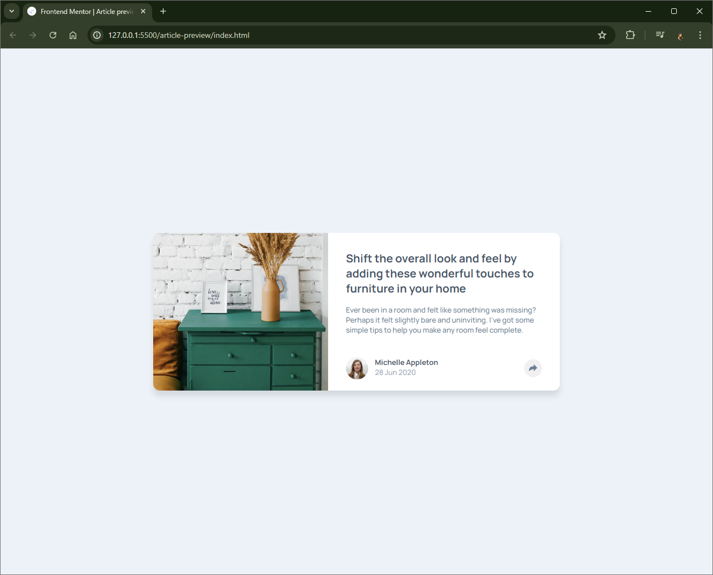

# Frontend Mentor - Article preview component solution

This is a solution to the [Article preview component challenge on Frontend Mentor](https://www.frontendmentor.io/challenges/article-preview-component-dYBN_pYFT). Frontend Mentor challenges help you improve your coding skills by building realistic projects.

## Table of contents

- [Overview](#overview)
  - [The challenge](#the-challenge)
  - [Screenshot](#screenshot)
  - [Links](#links)
- [My process](#my-process)
  - [Built with](#built-with)
  - [What I learned](#what-i-learned)
  - [Useful resources](#useful-resources)
- [Author](#author)

### The challenge

Users should be able to:

- View the optimal layout for the component depending on their device's screen size
- See the social media share links when they click the share icon

### Screenshot



### Links

- Solution URL: https://github.com/Vishika/front-end-mentor/tree/master/article-preview
- Live Site URL: https://article-preview-vish.netlify.app/

## My process

### Built with

- Semantic HTML5 markup
- CSS custom properties
- Flexbox
- CSS Grid
- Mobile-first workflow
- Javacript

### What I learned

In order to position the share icon inside the button properly I used absolute positioning rather than flex placement

```css
.share__btn {
  height: 3.2rem;
  width: 3.2rem;
  position: relative;
}

.share__btn__icon {
  position: absolute;
  top: 50%;
  left: 50%;
  transform: translate(-50%, -50%);
  height: 1.5rem;
  width: 1.5rem;
}
```

I created an alternative version of the svg rather than paste the svg in the html and change the fill

```html

```

I overlapped the author and share buttons in a grid in order to toggle between them, and so they would take up the same space. Unfortuantely I couldn't get the this to work with z-index alone as the border-radius seemed to peak out ever so slightly, I have no idea why, so I used a display none.

```css
.author {
  grid-area: footer;
}

.share {
  z-index: -1;
  grid-area: footer;
}
```

To create the speech bubble triangle created a box in a psuedo element and rotated it, obscuring half and creating a triangle. It is possible to do this with border top and making the left and right borders transparent on something with no width and height in a psuedo element.
I had to adjust the horizontal length of the box shadow, which is something I don't normally do.

```css
.share::after {
  content: "";
  height: 2rem;
  width: 2rem;
  background-color: var(--color-grey-dark);
  box-shadow: -0.5rem 0.5rem 0.5rem rgba(0, 0, 0, 0.2);
  position: absolute;
  bottom: 0;
  left: 50%;
  transform: translate(-50%, 50%) rotate(-45deg);
}
```

To "anchor" the share bubble to the share button, I used a new feature. While this is not supported by firefox it should be supported soon enough and I'd rather not play around with `getBoundingClientRect()`

```css
.share-btn {
  anchor-name: --share-btn;
}

.share {
  position: absolute;
  position-anchor: --share-btn;
  inset-area: top;
}
```

I added a transition to the display block with a new feature that allows discrete animation. Which again isn't supported by firefox yet

```css
.share {
  opacity: 1;
  transition: all 1s;
  transition-behavior: allow-discrete;
  translate: 0 0vh;
  @starting-style {
    opacity: 0;
    translate: 0 -10vh;
  }
}

.hidden {
  display: none;
  opacity: 0;
  translate: 0 -10vh;
}
```

### Useful resources

- [Speech bubble triangle](https://stackoverflow.com/questions/8866736/css-speech-bubble-with-box-shadow) - A guide to making the triangular part of a speech bubble.
- [Box shadow](https://www.cssmatic.com/box-shadow) - An easy refersher on box shadow features.
- [Position anchor](https://developer.chrome.com/blog/anchor-positioning-api) - A guide on anchor positioning API using the latest, albiet not fully supported css features.
- [Discrete transitions](https://www.youtube.com/watch?v=vmDEHAzj2XE) - A guide on discrete transitions and animations using the latest, albiet not fully supported css features.

## Author

- Frontend Mentor - [@vishika](https://www.frontendmentor.io/profile/vishika)
