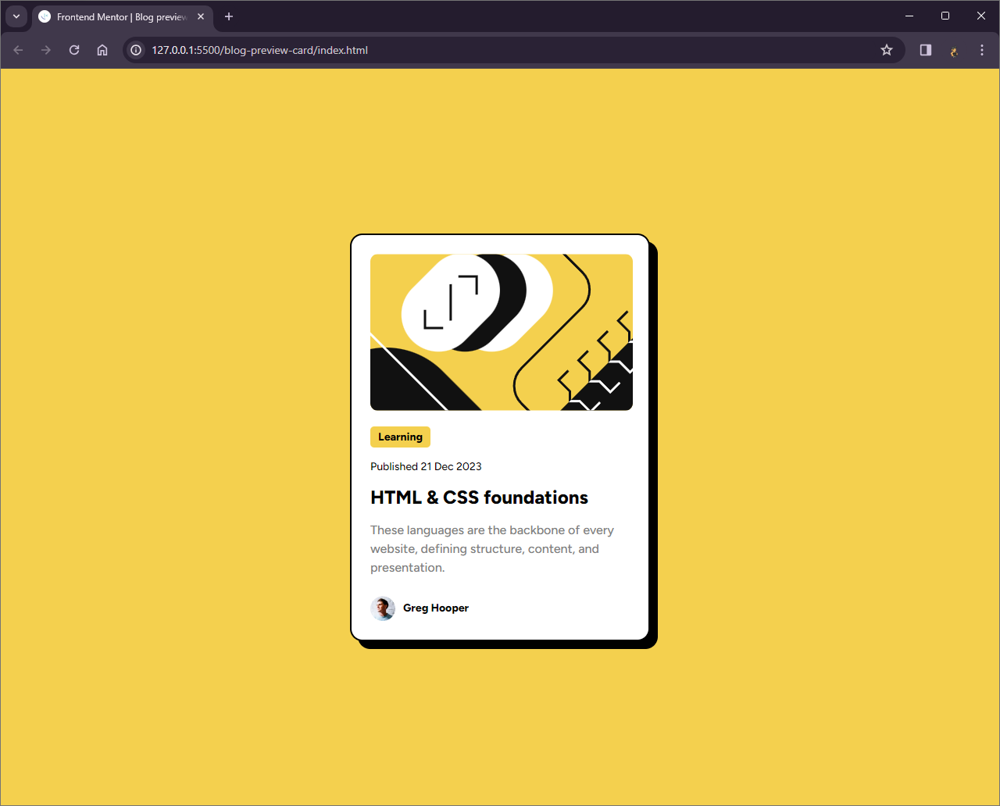

# Frontend Mentor - Blog preview card solution

This is a solution to the [Blog preview card challenge on Frontend Mentor](https://www.frontendmentor.io/challenges/blog-preview-card-ckPaj01IcS). Frontend Mentor challenges help you improve your coding skills by building realistic projects.

## Table of contents

- [Overview](#overview)
  - [The challenge](#the-challenge)
  - [Screenshot](#screenshot)
  - [Links](#links)
- [My process](#my-process)
  - [Built with](#built-with)
  - [What I learned](#what-i-learned)
  - [Useful resources](#useful-resources)
- [Author](#author)

## Overview

### The challenge

Users should be able to:

- See hover and focus states for all interactive elements on the page

### Screenshot



### Links

- Solution URL: https://github.com/Vishika/front-end-mentor/tree/master/blog-preview-card
- Live Site URL: https://blog-preview-card-vish.netlify.app/

## My process

### Built with

- Semantic HTML5 markup
- CSS custom properties
- Flexbox

### What I learned

Spacing, font size, line heights, were all reused among different properties to achieve a pleasant design.

```css
:root {
  --xl: 3.2rem;
  --l: 2.4rem;
  --m: 1.6rem;
  --s: 1.4rem;
  --xs: 1rem;
  --xxs: 0.5rem;
}
```

I learned how to incorporate TTF, true type fonts

```css
@font-face {
  font-family: figtree;
  src: url(assets/fonts/Figtree-VariableFont_wght.ttf);
}
```

## Author

- Frontend Mentor - [@vishika](https://www.frontendmentor.io/profile/vishika)
