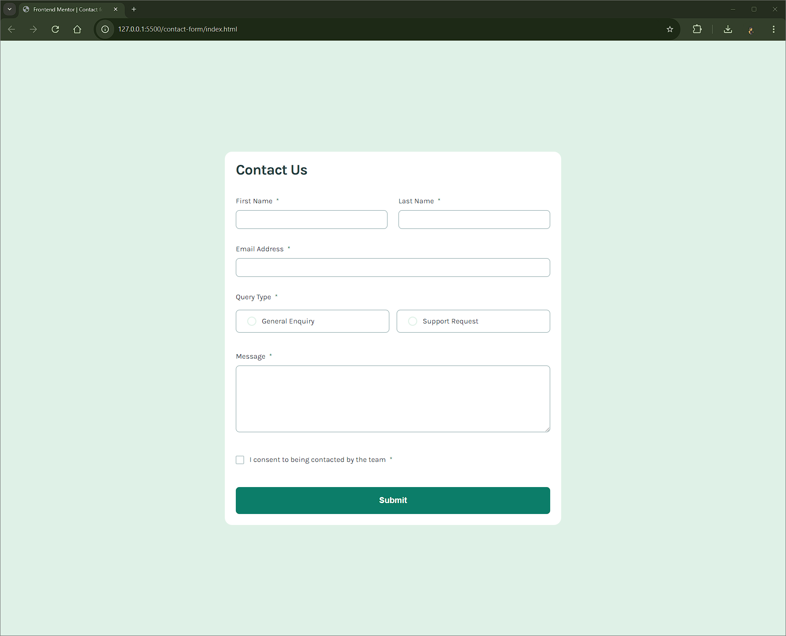

# Frontend Mentor - Contact form solution

This is a solution to the [Contact form challenge on Frontend Mentor](https://www.frontendmentor.io/challenges/contact-form--G-hYlqKJj). Frontend Mentor challenges help you improve your coding skills by building realistic projects.

## Table of contents

- [Overview](#overview)
  - [The challenge](#the-challenge)
  - [Screenshot](#screenshot)
  - [Links](#links)
- [My process](#my-process)
  - [Built with](#built-with)
  - [What I learned](#what-i-learned)
- [Author](#author)

## Overview

### The challenge

Users should be able to:

- Complete the form and see a success toast message upon successful submission
- Receive form validation messages if:
  - A required field has been missed
  - The email address is not formatted correctly
- Complete the form only using their keyboard
- Have inputs, error messages, and the success message announced on their screen reader
- View the optimal layout for the interface depending on their device's screen size
- See hover and focus states for all interactive elements on the page

### Screenshot



### Links

- Solution URL: https://github.com/Vishika/front-end-mentor/tree/master/contact-form
- Live Site URL: https://contact-form-vish.netlify.app/

## My process

### Built with

- Semantic HTML5 markup
- CSS custom properties
- Flexbox
- CSS Grid
- Mobile-first workflow

### What I learned

Make sure required asterix have the `aria-hidden="true"` property so they won't be read by screen readers.
We should also add a span to read out the word required for screen readers only.
And add `aria-describedby` property for one or more error messages.

```html
<label class="label" for="email">
  Email Address
  <span class="required" aria-hidden="true">*</span>
  <span class="sr-only">required</span>
</label>
<input
  class="input"
  type="text"
  id="first_name"
  name="first_name"
  autocomplete="given-name"
  required
  aria-invalid="false"
  aria-describedby="error-first_name"
/>
<p class="error_message" id="error-first_name">This field is required</p>
```

```css
.sr-only {
  clip-path: inset(100%);
  clip: rect(0 0 0 0);
  height: 1px;
  overflow: hidden;
  position: absolute;
  white-space: nowrap;
  width: 1px;
}
```

I learned how to use a modal for the first time, and that I ought to have a modal container to help position it.

```css
.modal-container {
  position: fixed;
  top: 0;
  width: 100dvw;
  display: flex;
  justify-content: center;
}

.modal {
  position: relative;
  margin: var(--space-lg);
  border: none;
}
```

### Useful resources

- [Radio button styling](https://moderncss.dev/pure-css-custom-styled-radio-buttons/) - This helped me style radio buttons.
- [Checkbox styling](https://moderncss.dev/pure-css-custom-checkbox-style/) - This helped me style checkboxes

## Author

- Frontend Mentor - [@vishika](https://www.frontendmentor.io/profile/vishika)
