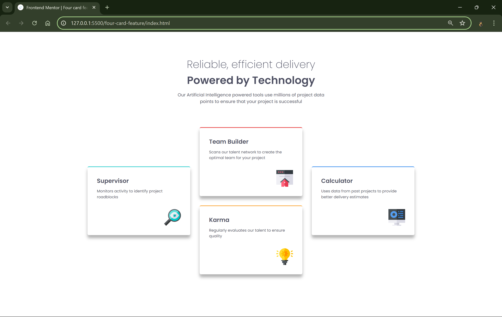

# Frontend Mentor - Four card feature section solution

This is a solution to the [Four card feature section challenge on Frontend Mentor](https://www.frontendmentor.io/challenges/four-card-feature-section-weK1eFYK). Frontend Mentor challenges help you improve your coding skills by building realistic projects.

## Table of contents

- [Overview](#overview)
  - [The challenge](#the-challenge)
  - [Screenshot](#screenshot)
  - [Links](#links)
- [My process](#my-process)
  - [Built with](#built-with)
  - [What I learned](#what-i-learned)
- [Author](#author)

## Overview

### The challenge

Users should be able to:

- View the optimal layout for the site depending on their device's screen size

### Screenshot



### Links

- Solution URL: https://github.com/Vishika/front-end-mentor/tree/master/four-card-feature
- Live Site URL: https://four-card-feature-vish.netlify.app/

## My process

### Built with

- Semantic HTML5 markup
- CSS custom properties
- Flexbox
- Mobile-first workflow

### What I learned

I used custom variables to only change the colour of the border accent

```css
.card {
  border-top: 0.3rem solid var(--color);
}

.card--1 {
  --color: var(--color-cyan);
}

.card--2 {
  --color: var(--color-red);
}
```

I figured out that I could do it using flexbox
It needed a column direction and a little margin to make sure
that only one item existed for the first and last column,
the justify-content was needed to ensure everything lined up on the main axis

```css
.cards {
  display: flex;
  flex-direction: column;
  gap: var(--space-lg);
}

@media (min-width: 75em) {
  .cards {
    height: 55rem;
    flex-wrap: wrap;
    justify-content: center;
  }

  .card--1,
  .card--4 {
    margin: var(--space-lg) 0;
  }
}
```

After playing around with grid, I decided that was the best way to go for this design
It's much more elegant using grid-template-areas

```css
.cards {
  @media (min-width: 75em) {
    display: grid;
    grid-template-areas:
      ". . t t . ."
      "l l t t r r"
      "l l b b r r"
      ". . b b . .";
  }

  .card--1 {
    grid-area: l;
  }

  .card--2 {
    grid-area: t;
  }

  .card--3 {
    grid-area: b;
  }

  .card--4 {
    grid-area: r;
  }
}
```

## Author

- Frontend Mentor - [@vishika](https://www.frontendmentor.io/profile/vishika)
