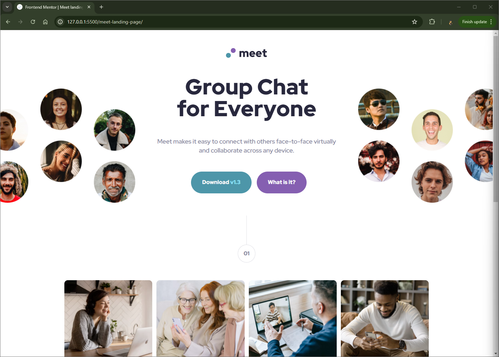

# Frontend Mentor - Meet landing page solution

This is a solution to the [Meet landing page challenge on Frontend Mentor](https://www.frontendmentor.io/challenges/meet-landing-page-rbTDS6OUR). Frontend Mentor challenges help you improve your coding skills by building realistic projects.

## Table of contents

- [Overview](#overview)
  - [The challenge](#the-challenge)
  - [Screenshot](#screenshot)
  - [Links](#links)
- [My process](#my-process)
  - [Built with](#built-with)
  - [What I learned](#what-i-learned)
  - [Useful resources](#useful-resources)
- [Author](#author)

## Overview

### The challenge

Users should be able to:

- View the optimal layout for the site depending on their device's screen size

### Screenshot



### Links

- Solution URL: https://github.com/Vishika/front-end-mentor/tree/master/meet-landing-page
- Live Site URL: https://meet-landing-page-vish.netlify.app/

## My process

### Built with

- Semantic HTML5 markup
- CSS custom properties
- Flexbox
- CSS Grid
- Mobile-first workflow

### What I learned

It took me a while to figure out where to hide the overflow-x when clipping the hero image

```css
.hero {
  width: 110%;
}

.hero-left,
.hero-right {
  width: 110%;
}

.section--1 {
  overflow-x: hidden;
}
```

I liked implementing this css feature I learned about a while ago

```css
.content--3 {
  max-width: 120rem;
  width: 80%;
}
```

I decided to go with better breakpoints with these

```css
@media (min-width: calc(600em / 16)) {
}

@media (min-width: calc(900em / 16)) {
}
```

### Useful resources

- [Better breakpoints](https://medium.com/free-code-camp/the-100-correct-way-to-do-css-breakpoints-88d6a5ba1862) - This helped me decide which breakpoints to target

## Author

- Frontend Mentor - [@vishika](https://www.frontendmentor.io/profile/vishika)
