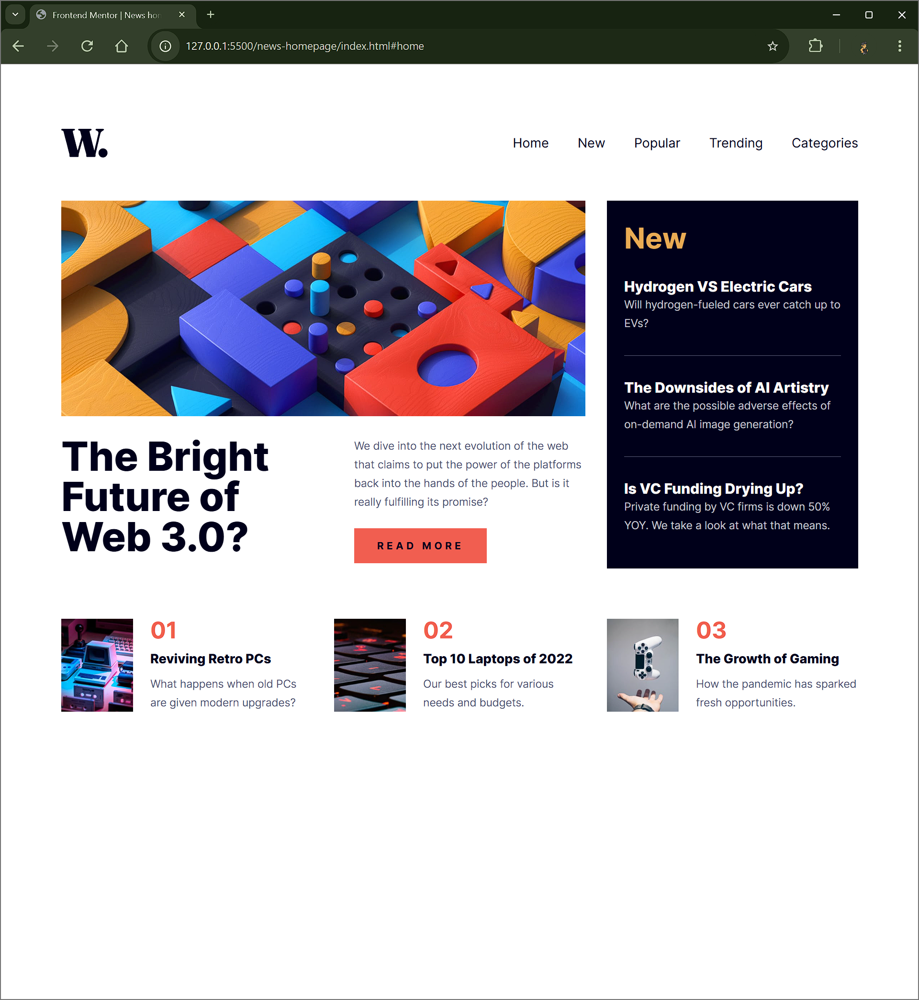

# Frontend Mentor - News homepage solution

This is a solution to the [News homepage challenge on Frontend Mentor](https://www.frontendmentor.io/challenges/news-homepage-H6SWTa1MFl). Frontend Mentor challenges help you improve your coding skills by building realistic projects.

## Table of contents

- [Overview](#overview)
  - [The challenge](#the-challenge)
  - [Screenshot](#screenshot)
  - [Links](#links)
- [My process](#my-process)
  - [Built with](#built-with)
  - [What I learned](#what-i-learned)
  - [Useful resources](#useful-resources)
- [Author](#author)

## Overview

### The challenge

Users should be able to:

- View the optimal layout for the interface depending on their device's screen size
- See hover and focus states for all interactive elements on the page

### Screenshot



### Links

- Solution URL: https://github.com/Vishika/front-end-mentor/tree/master/news-homepage
- Live Site URL: https://news-homepage-vish.netlify.app/

## My process

### Built with

- Semantic HTML5 markup
- CSS custom properties
- Flexbox
- CSS Grid
- Mobile-first workflow

### What I learned

It took a while for me to figure out how to dim the rest of the page using this css hack I found on [geeksforgeeks](https://www.geeksforgeeks.org/how-to-dim-entire-screen-except-a-fixed-area-using-javascript/)

```css
.open {
  box-shadow: 0 0 0 100vmax rgba(0, 0, 0, 0.7);
}
```

Getting the mobile navigation to be accessible was a lot of work, I found this tutorial from [codercoder](https://www.youtube.com/watch?v=pBv7igaxfQE)
The most helpful part of it was making certain parts `inert` which means they are inert to screen readers and keyboard navigation

```js
const openNav = function () {
  navOpen.setAttribute("aria-expanded", true);
  nav.removeAttribute("inert");
  ...
};

const closeNav = function () {
  navOpen.setAttribute("aria-expanded", false);
  nav.setAttribute("inert", "");
  ...
}
```

### Useful resources

- [geeksforgeeks](https://www.geeksforgeeks.org/how-to-dim-entire-screen-except-a-fixed-area-using-javascript/) - This helped me dim the rest of the page when the mobile navigation was open
- [codercoder](https://www.youtube.com/watch?v=pBv7igaxfQE) - This youtube tutorial helped me with making mobile navigation accessible

## Author

- Frontend Mentor - [@vishika](https://www.frontendmentor.io/profile/vishika)
