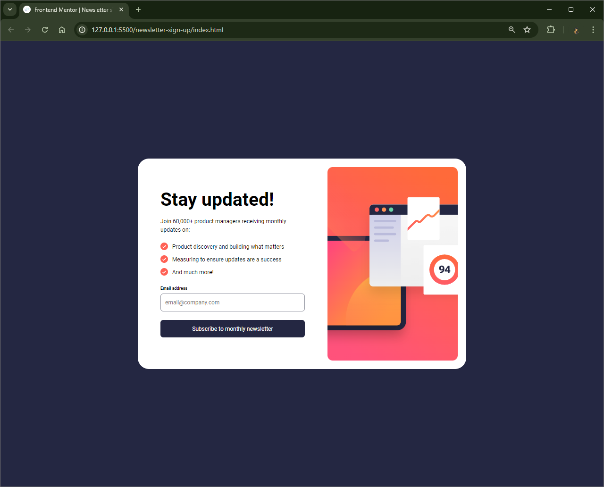

# Frontend Mentor - Newsletter sign-up form with success message solution

This is a solution to the [Newsletter sign-up form with success message challenge on Frontend Mentor](https://www.frontendmentor.io/challenges/newsletter-signup-form-with-success-message-3FC1AZbNrv). Frontend Mentor challenges help you improve your coding skills by building realistic projects.

## Table of contents

- [Overview](#overview)
  - [The challenge](#the-challenge)
  - [Screenshot](#screenshot)
  - [Links](#links)
- [My process](#my-process)
  - [Built with](#built-with)
  - [What I learned](#what-i-learned)
- [Author](#author)

**Note: Delete this note and update the table of contents based on what sections you keep.**

## Overview

### The challenge

Users should be able to:

- Add their email and submit the form
- See a success message with their email after successfully submitting the form
- See form validation messages if:
  - The field is left empty
  - The email address is not formatted correctly
- View the optimal layout for the interface depending on their device's screen size
- See hover and focus states for all interactive elements on the page

### Screenshot



### Links

- Solution URL: https://github.com/Vishika/front-end-mentor/tree/master/newsletter-sign-up
- Live Site URL: https://newsletter-sign-up-vish.netlify.app/

## My process

### Built with

- Semantic HTML5 markup
- CSS custom properties
- Flexbox
- CSS Grid
- Mobile-first workflow
- Javacript

### What I learned

I shared some of the transition code between two elements and realised that if I just transitioned the `opacity` rather than `all`, it would look a lot smoother.

```css
.hidable {
  opacity: 1;
  transition-property: opacity;
  transition-duration: 3s;
  transition-behavior: allow-discrete;
  transition-timing-function: ease-out;
  @starting-style {
    opacity: 0;
  }
}
```

I learned that I could capture all form data in javascript with one line from the front end mentor learning path

```js
Object.fromEntries(new FormData(event.target));
```

I learned that HTML5 has built in form input type validation we can utilize

```js
if (emailInput.value && emailInput.validity.valid) { ... }
```

I learned how to target elements with specific classes. In this case it helped as it meant I could keep the `.hidden` css on the main.css file, rather than have it at the end of the media.css file since

```css
/* main.css */
.hidden {
  display: none;
}

/* media.css */
article[class="signup hidable"] {
  display: flex;
}
```

## Author

- Frontend Mentor - [@vishika](https://www.frontendmentor.io/profile/vishika)
