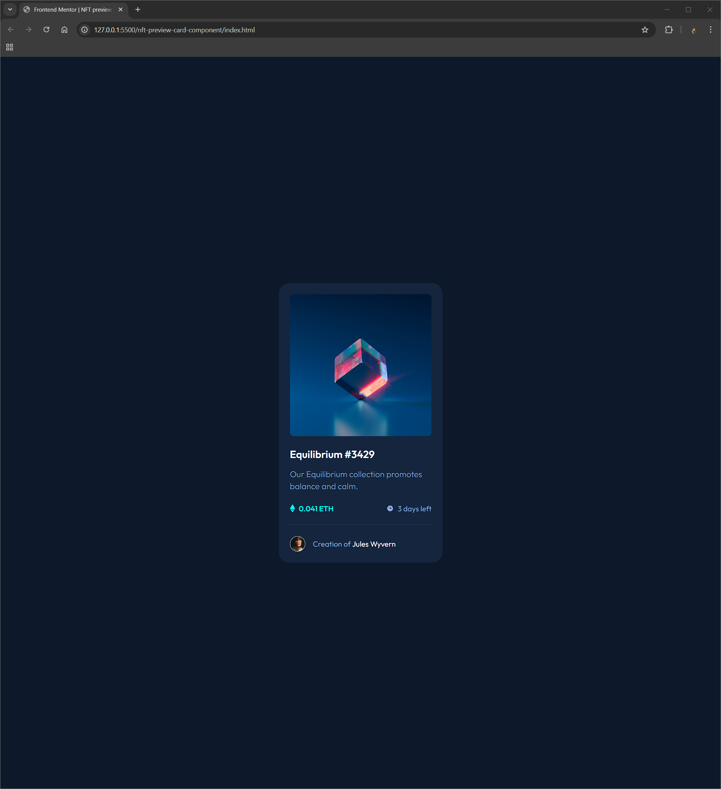

# Frontend Mentor - NFT preview card component solution

This is a solution to the [NFT preview card component challenge on Frontend Mentor](https://www.frontendmentor.io/challenges/nft-preview-card-component-SbdUL_w0U). Frontend Mentor challenges help you improve your coding skills by building realistic projects.

## Table of contents

- [Overview](#overview)
  - [The challenge](#the-challenge)
  - [Screenshot](#screenshot)
  - [Links](#links)
- [My process](#my-process)
  - [Built with](#built-with)
  - [What I learned](#what-i-learned)
  - [Useful resources](#useful-resources)
- [Author](#author)
- [Acknowledgments](#acknowledgments)

## Overview

### The challenge

Users should be able to:

- View the optimal layout depending on their device's screen size
- See hover states for interactive elements

### Screenshot



### Links

- Solution URL: https://github.com/Vishika/front-end-mentor/tree/master/nft-preview-card-component
- Live Site URL: https://nft-preview-card-component-vish.netlify.app/

## My process

### Built with

- Semantic HTML5 markup
- CSS custom properties
- Flexbox
- CSS Grid
- Mobile-first workflow

### What I learned

Instead of absolute positioning with translate...

```css
.u-pic-view {
  position: absolute;
  top: 50%;
  left: 50%;
  transform: translate(-50%, -50%);
}
```

I can use inset

```css
.u-pic-view {
  position: absolute;
  inset: 0;
  margin: auto;
}
```

### Useful resources

I learned how to use BEM properly with

- [BEM 101](https://css-tricks.com/bem-101/)
- [10 common problems](https://www.smashingmagazine.com/2016/06/battling-bem-extended-edition-common-problems-and-how-to-avoid-them/)
- [namespacing](https://csswizardry.com/2015/03/more-transparent-ui-code-with-namespaces/)

## Author

- Frontend Mentor - [@vishika](https://www.frontendmentor.io/profile/vishika)
