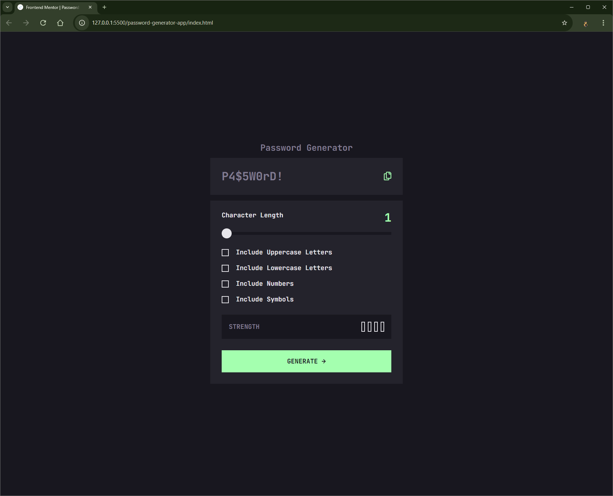

# Frontend Mentor - Password generator app solution

This is a solution to the [Password generator app challenge on Frontend Mentor](https://www.frontendmentor.io/challenges/password-generator-app-Mr8CLycqjh). Frontend Mentor challenges help you improve your coding skills by building realistic projects.

## Table of contents

- [Overview](#overview)
  - [The challenge](#the-challenge)
  - [Screenshot](#screenshot)
  - [Links](#links)
- [My process](#my-process)
  - [Built with](#built-with)
  - [What I learned](#what-i-learned)
  - [Continued development](#continued-development)
  - [Useful resources](#useful-resources)
- [Author](#author)

**Note: Delete this note and update the table of contents based on what sections you keep.**

## Overview

### The challenge

Users should be able to:

- Generate a password based on the selected inclusion options
- Copy the generated password to the computer's clipboard
- See a strength rating for their generated password
- View the optimal layout for the interface depending on their device's screen size
- See hover and focus states for all interactive elements on the page

### Screenshot



**Note: Delete this note and the paragraphs above when you add your screenshot. If you prefer not to add a screenshot, feel free to remove this entire section.**

### Links

- Solution URL: https://github.com/Vishika/front-end-mentor/tree/master/password-generator-app
- Live Site URL: https://password-generator-app-vish.netlify.app/

## My process

### Built with

- Semantic HTML5 markup
- CSS custom properties
- Flexbox
- CSS Grid
- Mobile-first workflow
- JavaScript

### What I learned

I hadn't done checkbox styling in a while, I used a resource to scale this polygon when checked.

```css
input[type="checkbox"]::before {
  content: "";
  clip-path: polygon(14% 44%, 0 65%, 50% 100%, 100% 16%, 80% 0%, 43% 62%);
  transform: scale(0);
}

input[type="checkbox"]:checked::before {
  transform: scale(1);
}
```

### Continued development

Use this section to outline areas that you want to continue focusing on in future projects. These could be concepts you're still not completely comfortable with or techniques you found useful that you want to refine and perfect.

**Note: Delete this note and the content within this section and replace with your own plans for continued development.**

### Useful resources

- [Slider styling](https://css-tricks.com/sliding-nightmare-understanding-range-input/) - This helped me understand how to style sliders.
- [Checkbox styling](https://moderncss.dev/pure-css-custom-checkbox-style/) - This helped me understand how to style checkboxes.

## Author

- Frontend Mentor - [@vishika](https://www.frontendmentor.io/profile/vishika)
