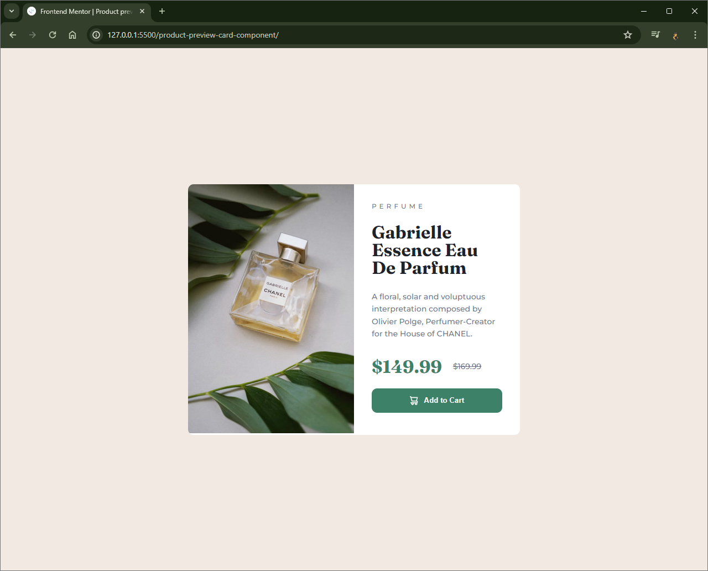

# Frontend Mentor - Product preview card component solution

This is a solution to the [Product preview card component challenge on Frontend Mentor](https://www.frontendmentor.io/challenges/product-preview-card-component-GO7UmttRfa). Frontend Mentor challenges help you improve your coding skills by building realistic projects.

## Table of contents

- [Overview](#overview)
  - [The challenge](#the-challenge)
  - [Screenshot](#screenshot)
  - [Links](#links)
- [My process](#my-process)
  - [Built with](#built-with)
  - [What I learned](#what-i-learned)
  - [Continued development](#continued-development)
  - [Useful resources](#useful-resources)
- [Author](#author)

**Note: Delete this note and update the table of contents based on what sections you keep.**

## Overview

### The challenge

Users should be able to:

- View the optimal layout depending on their device's screen size
- See hover and focus states for interactive elements

### Screenshot



### Links

- Solution URL: https://github.com/Vishika/front-end-mentor/tree/master/product-preview-card-component
- Live Site URL: https://product-preview-card-component-vish.netlify.app/

## My process

### Built with

- Semantic HTML5 markup
- CSS custom properties
- Flexbox
- Grid
- Mobile-first workflow

### What I learned

Used the picture element to provide different pictures for different sized screens

```html
<picture>
  <source
    srcset="images/image-product-desktop.jpg"
    media="(min-width: 37.5em)"
  />
  
</picture>
```

Use of a spacing system

```css
:root {
  --space-unit: 1.6em;
  --space-xxs: calc(0.25 * var(--space-unit));
  --space-xs: calc(0.5 * var(--space-unit));
  --space-sm: calc(0.75 * var(--space-unit));
  --space-md: calc(1.25 * var(--space-unit));
  --space-lg: calc(2 * var(--space-unit));
  --space-xl: calc(3.25 * var(--space-unit));
  --space-xxl: calc(5.25 * var(--space-unit));
}
```

Remembered how to download and import fonts

```css
@font-face {
  font-family: fraunces;
  src: url(fonts/fraunces.ttf);
}

html {
  font-family: montserrat, sans-serif;
}
```

Remembered how to center cards in the view without having to specify a card height.

```css
.container {
  min-height: 100vh;
  display: flex;
  align-items: center;
  justify-content: center;
}
```

Figured out how to fit the image properly so that there is no white space below anbd it takes up the appropriate size.

```css
.card__image {
  display: block;
  max-inline-size: 100%;
}
```

### Continued development

Use this section to outline areas that you want to continue focusing on in future projects. These could be concepts you're still not completely comfortable with or techniques you found useful that you want to refine and perfect.

**Note: Delete this note and the content within this section and replace with your own plans for continued development.**

### Useful resources

- [web.dev](https://web.dev/learn/design) - This helped with responsive images.
- [spacing system](https://medium.com/codyhouse/create-your-design-system-part-4-spacing-895c9213e2b9) - This article had a useful spacing system I used.

## Author

- Frontend Mentor - [@vishika](https://www.frontendmentor.io/profile/vishika)
