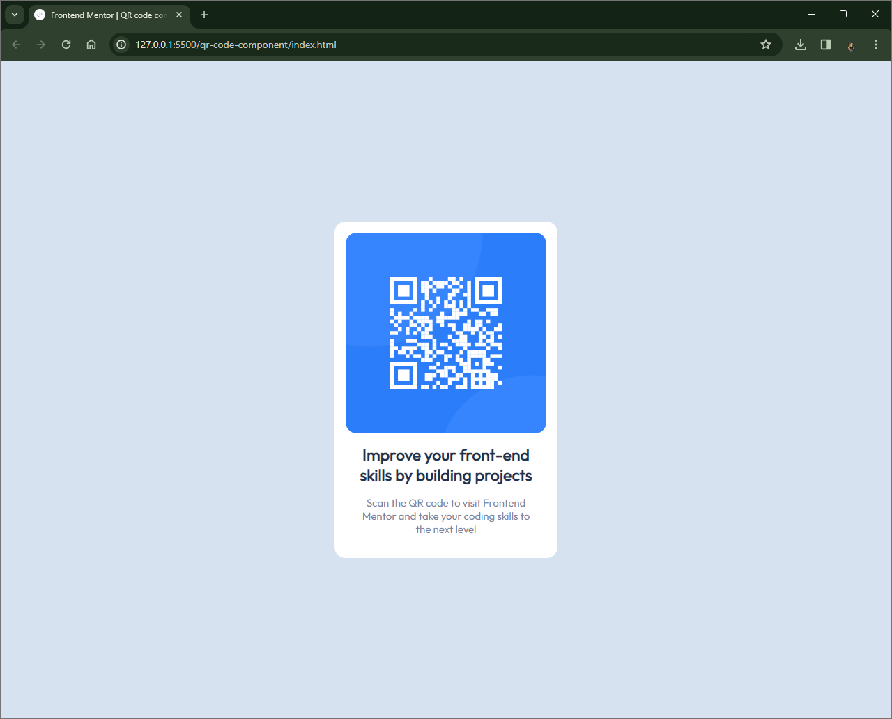

# Frontend Mentor - QR code component solution

This is a solution to the [QR code component challenge on Frontend Mentor](https://www.frontendmentor.io/challenges/qr-code-component-iux_sIO_H). Frontend Mentor challenges help you improve your coding skills by building realistic projects.

## Table of contents

- [Overview](#overview)
  - [Screenshot](#screenshot)
  - [Links](#links)
- [My process](#my-process)
  - [Built with](#built-with)
  - [What I learned](#what-i-learned)
- [Author](#author)

**Note: Delete this note and update the table of contents based on what sections you keep.**

## Overview

### Screenshot



### Links

- Solution URL: https://github.com/Vishika/front-end-mentor/tree/master/qr-code-component
- Live Site URL: https://qr-code-component-vish.netlify.app/

## My process

Imported google fonts
Centered a container with flexbox and viewheight
Based the containers width off 320px / 32rem
Rounded borders
Added padding

### Built with

- Semantic HTML5 markup
- CSS custom properties
- Flexbox
- Mobile-first workflow

### What I learned

the body needs a height (I used 100% view height) in order for card centering to work

```css
body {
  min-height: 100vh;
}
```

It's best to make the image 100% width, rather than set a width less than the container

```css
.img-qr {
  width: 100%;
}
```

## Author

- Frontend Mentor - [@vishika](https://www.frontendmentor.io/profile/vishika)
