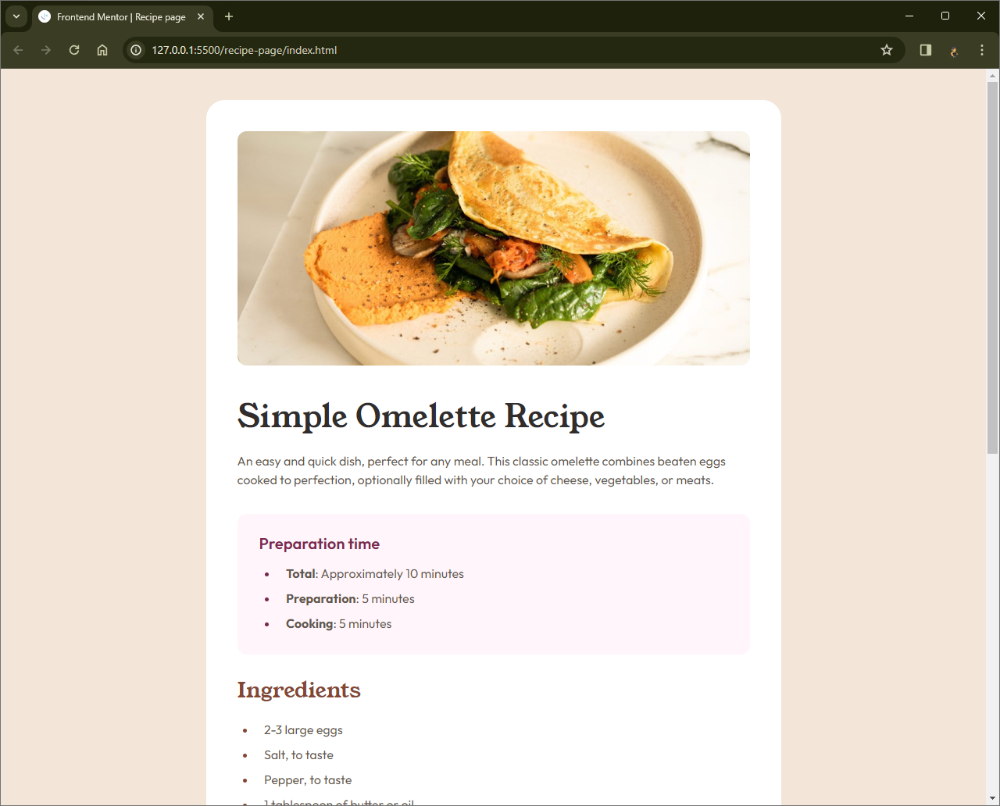

# Frontend Mentor - Recipe page solution

This is a solution to the [Recipe page challenge on Frontend Mentor](https://www.frontendmentor.io/challenges/recipe-page-KiTsR8QQKm). Frontend Mentor challenges help you improve your coding skills by building realistic projects.

## Table of contents

- [Overview](#overview)
  - [Screenshot](#screenshot)
  - [Links](#links)
- [My process](#my-process)
  - [What I learned](#what-i-learned)
  - [Continued development](#continued-development)
- [Author](#author)

## Overview

### Screenshot



### Links

- Solution URL: https://github.com/Vishika/front-end-mentor/tree/master/recipe-page
- Live Site URL: https://recipe-page-vish.netlify.app/

## My process

### What I learned

I used border for line breaks

```css
.line-break {
  height: var(--xl);
  border-top: 1px solid var(--color-white-coffee);
}
```

I learned about list styling, specifically allowing the markers to be on the inside helps with overall indentation, but outside will keep the indentation of points aligned if the text overflows to a second line or more with the first line.

```css
ul,
ol {
  list-style-position: outside;
}
```

And identifying the marker in order to colour it

```css
.recipe-section-prep li::marker {
  color: var(--color-dark-raspberry);
}
```

With the mobile view I had to remove the margin before it affected the symetry

```css
@media (max-width: 23.4375em) {
  .recipe {
    margin: 0;
  }
}
```

### Continued development

I'd like to figure out how to get the horizontal scroll to properly show for when the content is too wide for the view port.
The following doesn't work

```css
@media (max-width: 23.4375em) {
  html {
    overflow-x: scroll;
  }
}
```

## Author

- Frontend Mentor - [@vishika](https://www.frontendmentor.io/profile/vishika)
