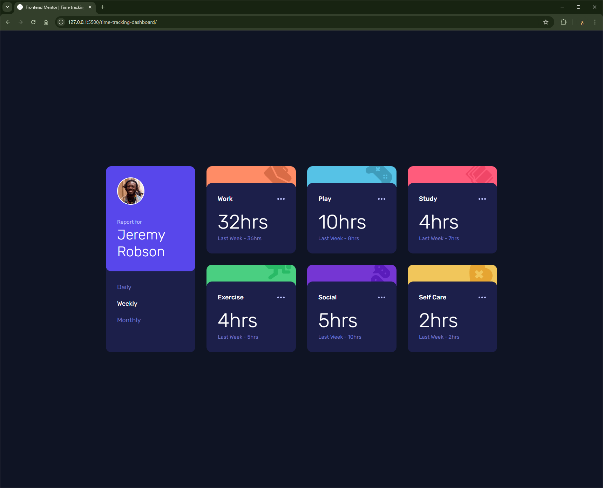

# Frontend Mentor - Time tracking dashboard solution

This is a solution to the [Time tracking dashboard challenge on Frontend Mentor](https://www.frontendmentor.io/challenges/time-tracking-dashboard-UIQ7167Jw). Frontend Mentor challenges help you improve your coding skills by building realistic projects.

## Table of contents

- [Overview](#overview)
  - [The challenge](#the-challenge)
  - [Screenshot](#screenshot)
  - [Links](#links)
- [My process](#my-process)
  - [Built with](#built-with)
  - [What I learned](#what-i-learned)
  - [Useful resources](#useful-resources)
- [Author](#author)

**Note: Delete this note and update the table of contents based on what sections you keep.**

## Overview

### The challenge

Users should be able to:

- View the optimal layout for the site depending on their device's screen size
- See hover states for all interactive elements on the page
- Switch between viewing Daily, Weekly, and Monthly stats

### Screenshot



### Links

- Solution URL: https://github.com/Vishika/front-end-mentor/tree/master/time-tracking-dashboard
- Live Site URL: https://time-tracking-dashboard-vish.netlify.app/

## My process

### Built with

- Semantic HTML5 markup
- CSS custom properties
- Flexbox
- CSS Grid
- Mobile-first workflow
- Javacript

### What I learned

When putting a simple border around the image for Jeremy, I noticed that there was a sliver of the background color leaking through so I had to create a white circle and place the image inside it.

```css
.img__border {
  display: block;
  width: 6.4rem;
  height: 6.4rem;
  background-color: var(--color-white);
  border-radius: 100%;
  display: grid;
  place-content: center;
}

.subject__img {
  width: 6rem;
  height: 6rem;
}

/* .subject__img {
  width: 6.4rem;
  height: 6.4rem;
  border-radius: 100%;
  border: 2px solid var(--color-white);
} */
```

For each of the `section.activity`, I couldn't do what I did with the `article.report`, having a sibling element alongside the inner content bubble extend the background of the container bubble.
Instead each sibling element had its own background color, and the container bubble was positioned relative, so the second sibling could stack a little on top of the first one, making the first sibling into a kind of border. This also allowed the "border sibling" to have an overflow of `hidden` so the illustration was only appeared within it. I'm not really happy with this, especially since I had to calculate and set parent heights in the media queries, but couldn't figure out a better way that didn't show a tiny sliver of the other element, much like in the above problem.

```css
.activity__border {
  height: var(--space-xxxxl);
  border-radius: var(--space-sm);
  position: relative;
  overflow: hidden;
}

.activity__img {
  position: absolute;
  top: calc(var(--space-xs) * -1);
  right: var(--space-xs);
}

.activity__info {
  position: absolute;
  width: 100%;
  top: var(--space-xxl);
  background-color: var(--color-blue-dark);
  border-radius: var(--space-sm);
}
```

I'm fairly happy with my javascript solution for changing the state of `aria-selected` on the hyperlinks using both `event.currentTarget` and `event.target`. Though I'm not sure if they should have been buttons, I liked how the selection area was large. I was contemplating making all of the JavaScript functions pure functions, but decided against it.

```js
const selectTimeFrame = function (event) {
  for (const timeFrame of event.currentTarget.children) {
    timeFrame.setAttribute("aria-selected", timeFrame === event.target);
  }
  loadPage();
};

timeFramesContainer.addEventListener("click", selectTimeFrame);
```

After trying for a while to get subgrids to work, I ended thinking that what I was trying to do was not possible with subgrids. Perhaps I should have put the all the `.activity` elements in the same container as the `.report` and manually deleted all the `article.activity` elements instead of clearing `acitivites`. Instead I kept the javascript insignificantly more efficient and made some pretty convoluted media queries with nested grids that were exactly the same and absolute positioning...

```css
.cards {
  position: relative;
}

.cards,
.activities {
  gap: var(--space-xl);
  grid-template-columns: repeat(2, 25.5rem);
  grid-template-rows: repeat(4, 24.95rem);
  grid-template-areas:
    "report card-1"
    "report card-2"
    "card-3 card-4"
    "card-5 card-6";
}

.report {
  z-index: 1;
  position: static;
  grid-area: report;
}

.activities {
  position: absolute;
}

.activity--work {
  grid-area: card-1;
}

.activity--play {
  grid-area: card-2;
}

.activity--study {
  grid-area: card-3;
}

.activity--exercise {
  grid-area: card-4;
}

.activity--social {
  grid-area: card-5;
}

.activity--self-care {
  grid-area: card-6;
}
```

### Useful resources

- [Subheadings](https://css-tricks.com/html-for-subheadings-and-headings/) - This helped me figure out what html and css classes to use for headings and subheadings, something I've always been indicisive about.

## Author

- Frontend Mentor - [@vishika](https://www.frontendmentor.io/profile/vishika)
