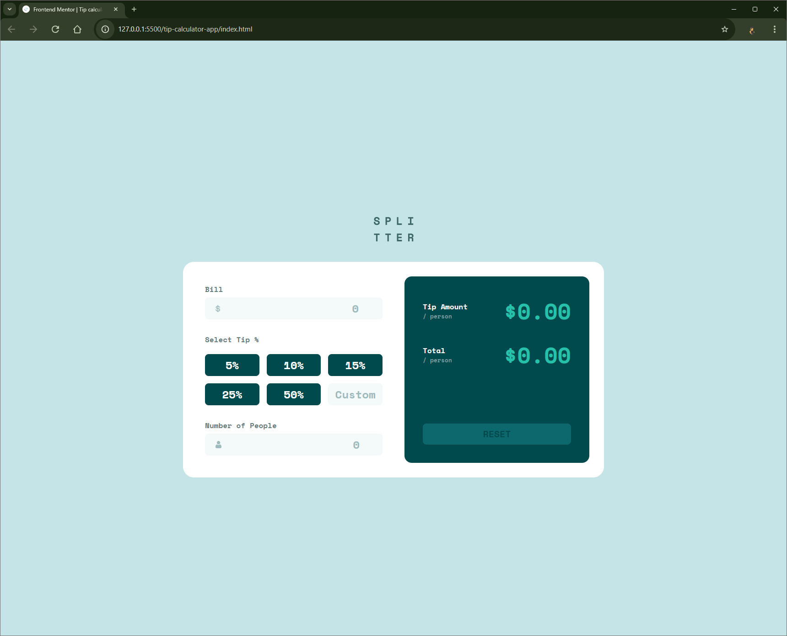

# Frontend Mentor - Tip calculator app solution

This is a solution to the [Tip calculator app challenge on Frontend Mentor](https://www.frontendmentor.io/challenges/tip-calculator-app-ugJNGbJUX). Frontend Mentor challenges help you improve your coding skills by building realistic projects.

## Table of contents

- [Overview](#overview)
  - [The challenge](#the-challenge)
  - [Screenshot](#screenshot)
  - [Links](#links)
- [My process](#my-process)
  - [Built with](#built-with)
  - [What I learned](#what-i-learned)
  - [Continued development](#continued-development)
- [Author](#author)

## Overview

### The challenge

Users should be able to:

- View the optimal layout for the app depending on their device's screen size
- See hover states for all interactive elements on the page
- Calculate the correct tip and total cost of the bill per person

### Screenshot



### Links

- Solution URL: https://github.com/Vishika/front-end-mentor/tree/master/tip-calculator-app
- Live Site URL: https://tip-calculator-app-vish.netlify.app/

## My process

### Built with

- Semantic HTML5 markup
- CSS custom properties
- Flexbox
- CSS Grid
- Mobile-first workflow
- JavaScript

### What I learned

Learned about the use of the `:has` selector, which was useful for selecting the parent container of my raido inputs if they were selected

```css
.input-field:has(.input-element:focus) {
  --border-color: var(--color-primary);
}
```

When introducing borders to the custom input within the "tips" section, I noticed that the widths and heights at 100% would not account for the border. at first I calculated the width with `calc(100% - 0.6rem)`, but then I realisd it was because I had unset the everything on the inputs, which included unsetting the `box-sizing: border-box;` I had done as part of my css reset. So i simply did the unsetting earlier, though for specificity reasons I had to include input and button explicitly.

```css
input,
button {
  all: unset;
}

*,
*::before,
*::after,
input,
button {
  box-sizing: border-box;
}
```

Validation is difficult to do nicely in an object orientated way, especially so because of the uniqueness of the tip input, which is a combination of psueo radio buttons and a number input.

### Continued development

I would like to use some class based inheritence to abstract each input with methods for validation.

## Author

- Frontend Mentor - [@vishika](https://www.frontendmentor.io/profile/vishika)
